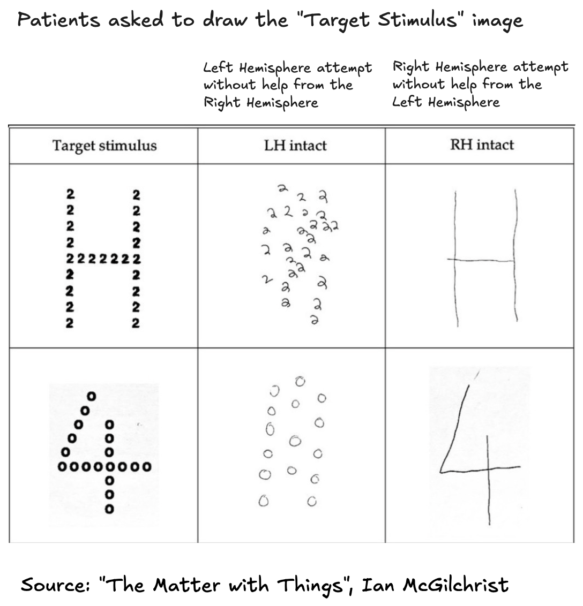
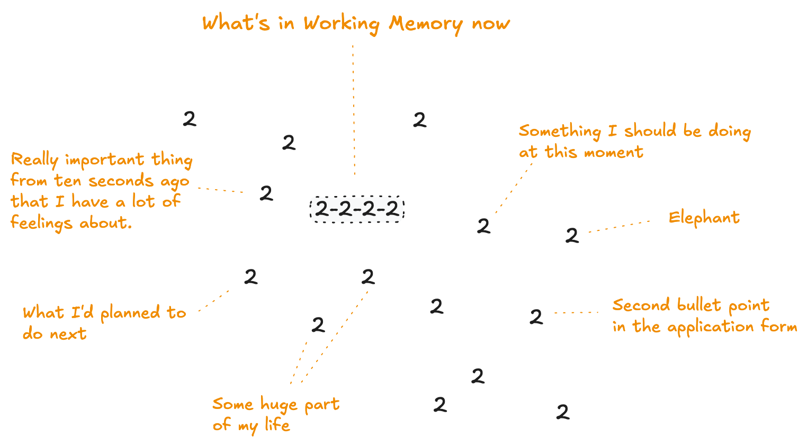
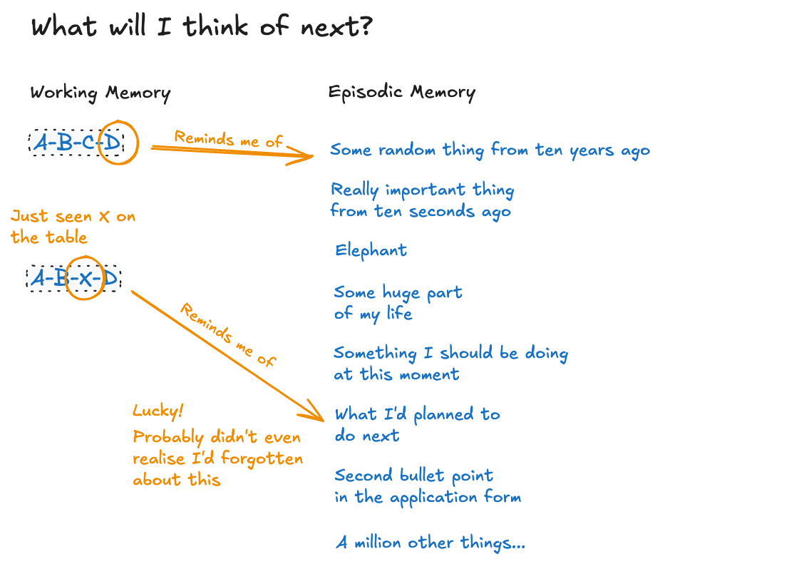
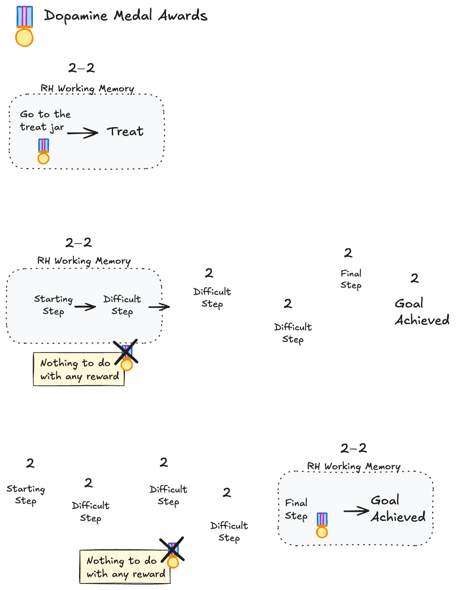
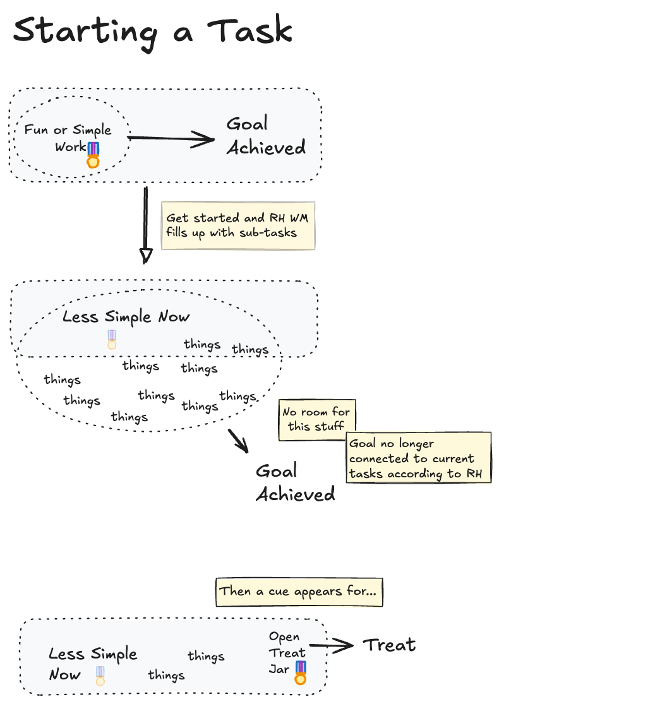

Robert B - Nov 2024

>*Note: Aside from the first image, these are my opinions - not evidenced-based results*

I have often pondered how working memory limitations might account for various inattentive ADHD symptoms. Recently, while reading a most enlightening (and lengthy) tome - "The Matter with Things" by Ian McGilchrist - I encountered this image...

My embellished summary here is that the information held in working memory of our right hemisphere (RH) is the single, full, broad-brush view of what is going on at any moment, including the "interoceptive" feelings from our body and whatever plans and recollections may have appeared in our mental world. This is a low-resolution landscape of interconnected physical, social and temporal features. Critically it includes our emotional state along with previously felt emotions about the various features. Although there will be some point of focus in this landscape where the left  hemisphere (LH) has added a patch of fine detail, **the full interconnected changing picture is held by the right hemisphere in working memory (WM).**

### Consequences of Limited RH WM

Using the 'H' made of '2's image as a reference, **if this RH is limited by some less-than-average WM capacity**, then you might get situations like this arising in a typical day...

T**he items outside WM have not been forgotten, but have been *forgotten about***. They will generally be present in episodic memory, **but they will only ever come to mind again if a suitable cue arises, which is generally down to luck**...

### Effect on Dopamine

A second-order effect ***may be*** to limit the capabilities of our dopamine-based motivation system. Furthermore, if this has been experienced throughout life, then *perhaps* this could also affect base-levels of dopamine.

***This is highly speculative***, but **it may be that for an action to gain credit assignment for some outcome, there must be some "strong-enough" chain of causation held in a *single* RH WM view**. In the illustration below, the difficult steps do not have any dopaminergic motivational boost because the brain is never aware that they have anything to do with some later benefit. This would mean that willpower is required throughout!

One more detailed example is starting a task but then moving on to something else...

There will be other factors, such as the simple fact of starting a task reduces its perceived urgency relative to other tasks that have not even been started. This can result in a lot of task switching.

Speaking of which...
ToDos:
* Autopilot - and more on what RH WM actually holds
* Creativity
* RSD
* Hyper-Focus
* Why many things, such as IQ scores, are not notably affected

### Closing Notes

- An alternative to a reduced WM size is a normal-sized WM being filled up too quickly by new things.
